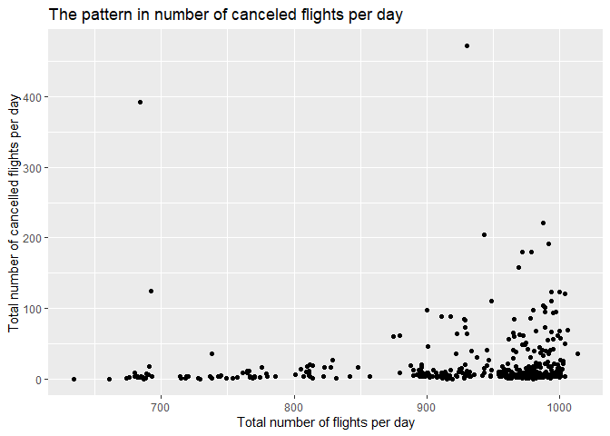
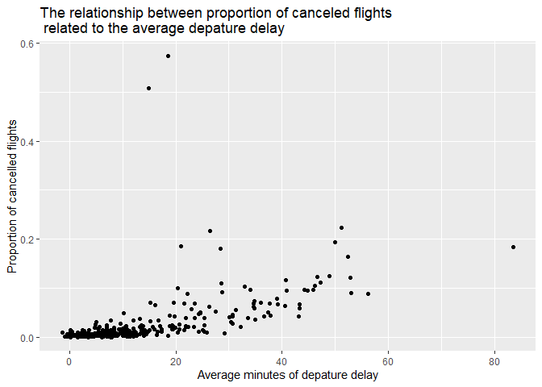
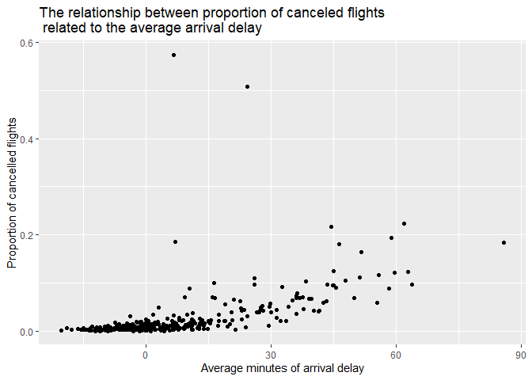

STAT 433 HW1
================
2022-09-26

# The following questions come from r4ds, and answered by Fenghang Yao (<fyao4@wisc.edu>).

## Q1:How many flights have a missing dep_time? What other variables are missing? What might these rows represent?

``` r
flights %>%
  filter(is.na(dep_time))
```

    ## # A tibble: 8,255 × 19
    ##     year month   day dep_time sched_de…¹ dep_d…² arr_t…³ sched…⁴ arr_d…⁵ carrier
    ##    <int> <int> <int>    <int>      <int>   <dbl>   <int>   <int>   <dbl> <chr>  
    ##  1  2013     1     1       NA       1630      NA      NA    1815      NA EV     
    ##  2  2013     1     1       NA       1935      NA      NA    2240      NA AA     
    ##  3  2013     1     1       NA       1500      NA      NA    1825      NA AA     
    ##  4  2013     1     1       NA        600      NA      NA     901      NA B6     
    ##  5  2013     1     2       NA       1540      NA      NA    1747      NA EV     
    ##  6  2013     1     2       NA       1620      NA      NA    1746      NA EV     
    ##  7  2013     1     2       NA       1355      NA      NA    1459      NA EV     
    ##  8  2013     1     2       NA       1420      NA      NA    1644      NA EV     
    ##  9  2013     1     2       NA       1321      NA      NA    1536      NA EV     
    ## 10  2013     1     2       NA       1545      NA      NA    1910      NA AA     
    ## # … with 8,245 more rows, 9 more variables: flight <int>, tailnum <chr>,
    ## #   origin <chr>, dest <chr>, air_time <dbl>, distance <dbl>, hour <dbl>,
    ## #   minute <dbl>, time_hour <dttm>, and abbreviated variable names
    ## #   ¹​sched_dep_time, ²​dep_delay, ³​arr_time, ⁴​sched_arr_time, ⁵​arr_delay

We can see that there are 8255 rows of data which have NA under dep_time
(departure time) column.And we should also notice that arr_time (arrival
time) column also has all NA for these rows. In my opinion, these
flights are cancelled for some reasons, so that they don’t have both
departure time and arrival time.

## Q2: Currently dep_time and sched_dep_time are convenient to look at, but hard to compute with because they’re not really continuous numbers. Convert them to a more convenient representation of number of minutes since midnight.

First we need to know that the current dep_time and sched_dep_time are
in format HHMM (Hours Minutes), for example 517 means 5:17am. So in this
question, we want to convert 517 (5:17) to 317 $(5\times60 + 17 = 317)$
minutes which represent 317 minutes after midnight.Also, midnight is
represented as 2400 in current format, and it correspond to 1440
minutes, and it need to be changed to 0 after the convertion.

``` r
flights_inMinutes =flights %>%
  mutate(dep_time_inMinutes = (dep_time %/% 100 * 60 + dep_time %% 100)%%1440,
         sched_dep_time_inMinutes = (sched_dep_time %/% 100 * 60 + sched_dep_time %% 100)%%1440)
flights_inMinutes %>%
  select('sched_dep_time_inMinutes','dep_time_inMinutes')
```

    ## # A tibble: 336,776 × 2
    ##    sched_dep_time_inMinutes dep_time_inMinutes
    ##                       <dbl>              <dbl>
    ##  1                      315                317
    ##  2                      329                333
    ##  3                      340                342
    ##  4                      345                344
    ##  5                      360                354
    ##  6                      358                354
    ##  7                      360                355
    ##  8                      360                357
    ##  9                      360                357
    ## 10                      360                358
    ## # … with 336,766 more rows

## Q3: Look at the number of canceled flights per day. Is there a pattern? Is the proportion of canceled flights related to the average delay? Use multiple dyplr operations, all on one line, concluding with ggplot(aes(x= ,y=)) + geom_point()

The first question I want to address is that what is the pattern of the
number of canceled flights per day.So I want to see the relationship
between the canceled flights and total flights per day. In Q1, we define
cancelled flights as the ones with NA in arr_time and dep_time columns.

``` r
canclled_flights_perDay = flights %>%
  mutate(cancelled = (is.na(dep_time) & is.na(arr_time))) %>% 
  group_by(year, month, day)%>%
  summarise(sum_cancelled_perDay = sum(cancelled), total_flights_perDay = n(),cancelled_prop
            =sum_cancelled_perDay/total_flights_perDay,avg_dep_delay = mean(dep_delay, na.rm = TRUE),
            avg_arr_delay = mean(arr_delay, na.rm = TRUE))
```

    ## `summarise()` has grouped output by 'year', 'month'. You can override using the
    ## `.groups` argument.

``` r
canclled_flights_perDay
```

    ## # A tibble: 365 × 8
    ## # Groups:   year, month [12]
    ##     year month   day sum_cancelled_perDay total_flight…¹ cance…² avg_d…³ avg_a…⁴
    ##    <int> <int> <int>                <int>          <int>   <dbl>   <dbl>   <dbl>
    ##  1  2013     1     1                    4            842 0.00475   11.5   12.7  
    ##  2  2013     1     2                    8            943 0.00848   13.9   12.7  
    ##  3  2013     1     3                   10            914 0.0109    11.0    5.73 
    ##  4  2013     1     4                    6            915 0.00656    8.95  -1.93 
    ##  5  2013     1     5                    3            720 0.00417    5.73  -1.53 
    ##  6  2013     1     6                    1            832 0.00120    7.15   4.24 
    ##  7  2013     1     7                    3            933 0.00322    5.42  -4.95 
    ##  8  2013     1     8                    4            899 0.00445    2.55  -3.23 
    ##  9  2013     1     9                    5            902 0.00554    2.28  -0.264
    ## 10  2013     1    10                    3            932 0.00322    2.84  -5.90 
    ## # … with 355 more rows, and abbreviated variable names ¹​total_flights_perDay,
    ## #   ²​cancelled_prop, ³​avg_dep_delay, ⁴​avg_arr_delay

We next plot cancelled flights per day, with total number of flights per
day in x axis, total number of cancelled flights per day in y axis.

``` r
ggplot(canclled_flights_perDay) +
  geom_point(aes(x = total_flights_perDay , y = sum_cancelled_perDay))+
  xlab("Total number of flights per day")+
  ylab("Total number of cancelled flights per day") +
  ggtitle("The pattern in number of canceled flights per day")
```

<!-- --> <br/> We can
see from the plot above that when the total number of flights per day
increases,the total number of cancelled flight per day increases. Maybe
this is because when more flights scheduled, there would be a higher
probability of cancellations.

The second question I want to address is the relationship between
proportion of canceled flights related to the average delay. Here are
two kinds of delay, one is departure delay, another is arrival delay. I
will consider both of them with the proportion of canceled flights.

``` r
ggplot(canclled_flights_perDay) +
  geom_point(aes(x = avg_dep_delay , y = cancelled_prop))+
  xlab("Average minutes of depature delay")+
  ylab("Proportion of cancelled flights") +
  ggtitle("The relationship between proportion of canceled flights \n related to the average depature delay")
```

<!-- --> <br/>
According to the plot above, there is an obvious positive relationship
between proportion of canceled flights and the average departure delay.

``` r
ggplot(canclled_flights_perDay) +
  geom_point(aes(x = avg_arr_delay , y = cancelled_prop))+
  xlab("Average minutes of arrival delay")+
  ylab("Proportion of cancelled flights") +
  ggtitle("The relationship between proportion of canceled flights \n related to the average arrival delay")
```

<!-- --> <br/>
According to the plot above, there is also an obvious positive
relationship between proportion of canceled flights and the average
arrival delay.
